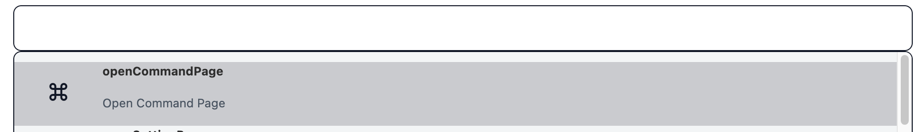
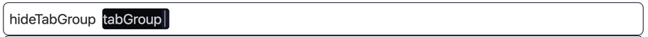
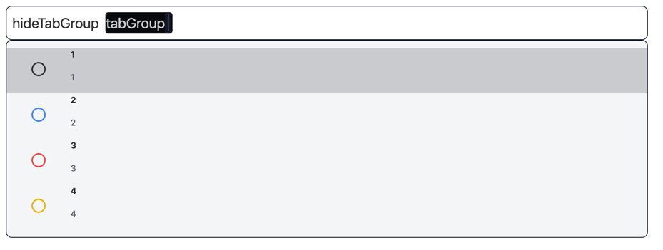

# What is a Command

When you add a command, it will show on the command list which is shown by typing Control + J.

# Options

Each command has multiple options.

# Choices

Each option has no choice which means you can type anything you want. Or you can add multiple choices.
These choices are will be auto-completed when you choose a option.

